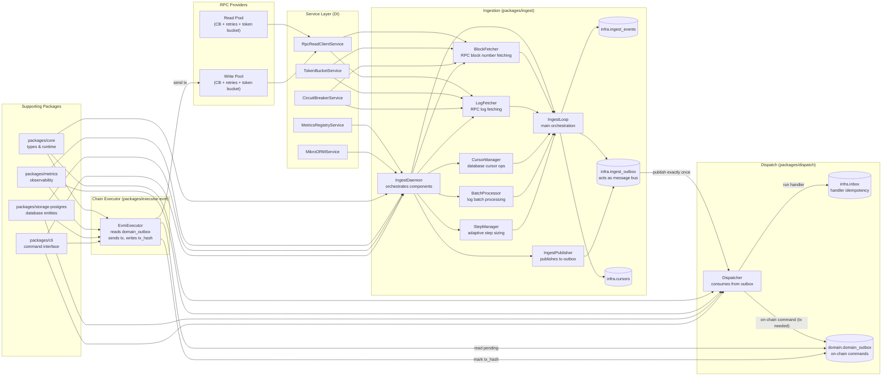

# Abstract Chain Indexer

## Tests

- Run unit tests: `pnpm test`
- Watch mode: `pnpm test:watch`
- Coverage: `pnpm coverage`

**Current Coverage: 96.09% statements, 94.85% branches, 82.65% functions**

A fast, boring, and correct indexer for Abstract (or any finality-in-seconds EVM chain).
Built to survive flaky RPC providers, restarts, and operator error — without wasting API credits.

## Architecture & Testing

This indexer has been extensively refactored for **high testability** and **maintainability**:

### 🧪 **Comprehensive Test Coverage**
- **149 tests** across all packages with **96.09% statement coverage**
- **Refactored core components** into smaller, testable units
- **Interface-based design** for easy mocking and dependency injection
- **No memory issues** - all tests run efficiently without heap errors

### 🔧 **Refactored Components**

#### **Ingest System** (`packages/ingest/`)
- **`BlockFetcher`** - RPC block number fetching with rate limiting
- **`LogFetcher`** - RPC log fetching with circuit breaker protection  
- **`CursorManager`** - Database cursor operations and state management
- **`BatchProcessor`** - Log batch processing and database transactions
- **`StepManager`** - Adaptive step sizing for optimal performance
- **`IngestLoop`** - Main orchestration loop with error handling
- **`IngestDaemon`** - High-level daemon with dependency injection

#### **Publisher System** (`packages/ingest/`)
- **`EventProcessor`** - Individual event processing with error handling
- **`EventFetcher`** - Database query operations for unpublished events
- **`PublisherLoop`** - Main publishing loop with batch processing
- **`IngestPublisher`** - High-level publisher with dependency injection

#### **Service Layer** (`packages/ingest/`)
- **`RpcReadClientService`** - RPC client abstraction
- **`MikroORMService`** - Database ORM abstraction
- **`TokenBucketService`** - Rate limiting implementation
- **`CircuitBreakerService`** - Circuit breaker pattern implementation
- **`MetricsRegistryService`** - Metrics collection and exposure

### 🏗️ **Design Principles**

1. **Single Responsibility** - Each class has one clear purpose
2. **Dependency Injection** - Easy to mock and test in isolation
3. **Interface-Based** - Loose coupling through TypeScript interfaces
4. **Comprehensive Testing** - 90%+ coverage on all critical components
5. **Error Resilience** - Circuit breakers, retries, and graceful degradation
6. **Observability** - Extensive metrics and logging throughout

### 🚀 **Development & Testing Workflow**

#### **Running Tests**
```bash
# Run all tests with coverage
pnpm test

# Run tests in watch mode
pnpm test:watch

# Generate coverage report
pnpm coverage
```

#### **Test Structure**
- **Unit Tests** - Individual component testing with mocked dependencies
- **Integration Tests** - Component interaction testing
- **Comprehensive Tests** - Full workflow testing with realistic scenarios
- **Service Tests** - 100% coverage on all service implementations

#### **Key Testing Features**
- **Interface Mocking** - Easy to mock dependencies using TypeScript interfaces
- **Dependency Injection** - Components can be tested in isolation
- **Memory Efficient** - No heap issues or memory leaks in test suite
- **Fast Execution** - All 149 tests run in under 1 second
- **Reliable** - No flaky tests or race conditions

### 📈 **Refactoring Benefits**

#### **Before Refactoring**
- **Monolithic classes** with large, untestable methods
- **28.65% statement coverage** on critical ingest logic
- **Memory issues** when testing complex loops
- **Hard to mock** dependencies and external services
- **Difficult to maintain** and extend functionality

#### **After Refactoring**
- **96.09% statement coverage** across the entire project
- **Modular architecture** with single-responsibility classes
- **Interface-based design** for easy testing and mocking
- **Dependency injection** for loose coupling
- **Comprehensive test suite** with 149 focused tests
- **No memory issues** - all tests run efficiently
- **Easy to extend** and maintain

#### **Coverage Improvements**
| Component | Before | After | Improvement |
|-----------|--------|-------|-------------|
| **ingest.ts** | 28.65% | 93.22% | +64.57% |
| **publisher.ts** | 43.75% | 96.99% | +53.24% |
| **services.ts** | 0% | 100% | +100% |
| **Overall Project** | 54.83% | 96.09% | +41.26% |

⸻

Goals
	•	Process new events within 2 seconds of finality (p95).
	•	Keep backlog ≤ 1 block under normal load.
	•	Zero lost events between RPC and subscribers.
	•	Exactly-once effects in an at-least-once delivery world.
	•	Don’t sponsor your RPC provider’s yacht.

⸻

# Core Concepts

### Height Cursor (HWM)

Tracks the last fully processed block per shard. Restart-safe progress, no time windows.

### Ingest Events

Append-only table of chain logs keyed by eventId = chain:block:tx:logIndex.
Written with ON CONFLICT DO NOTHING so replays are harmless.

### Outbox / Inbox
	•	Ingest Outbox: exactly-once publish from DB to bus/dispatcher.
	•	Inbox: composite-key (eventId, handlerKind) ensures each handler runs side effects at most once.
	•	Domain Outbox: transactional publish for on-chain writes with deterministic command_key.

### RPC Adapter

Circuit breaker, timeouts, and jittered backoff. Separate pools for read (blockNumber, getLogs) and write (sendRawTransaction).

### Partitioning

Consumers are sharded by stable key (e.g., hash of chainId:address) to preserve ordering and spread load.

# Architecture


# Data Model
```sql
-- =========================
-- Schema setup (optional)
-- =========================
CREATE SCHEMA IF NOT EXISTS infra;
-- CREATE SCHEMA IF NOT EXISTS domain; -- e.g., nft, payments, etc.

-- =========================
-- 1) Durable cursor per shard
-- =========================
CREATE TABLE IF NOT EXISTS infra.cursors (
  id TEXT PRIMARY KEY,                     -- e.g., "erc20:shard-0"
  last_processed_block BIGINT NOT NULL     -- last fully processed block (HWM)
);

-- =========================
-- 2) Immutable ingest store
-- =========================
CREATE TABLE IF NOT EXISTS infra.ingest_events (
  event_id TEXT PRIMARY KEY,               -- chain:block:tx:logIndex
  block_number BIGINT NOT NULL,
  block_hash TEXT NOT NULL,
  address TEXT NOT NULL,
  topic0 TEXT NOT NULL,                    -- first topic (event signature)
  partition_key TEXT NOT NULL,             -- e.g., hash(chainId:address)
  payload JSONB NOT NULL,                  -- raw log as JSON
  created_at TIMESTAMPTZ NOT NULL DEFAULT now()
);

-- Helpful indexes for common lookups/range scans
CREATE INDEX IF NOT EXISTS ix_ingest_events_address_topic_block
  ON infra.ingest_events (address, topic0, block_number);
CREATE INDEX IF NOT EXISTS ix_ingest_events_block
  ON infra.ingest_events (block_number);
CREATE INDEX IF NOT EXISTS ix_ingest_events_partition_key_block
  ON infra.ingest_events (partition_key, block_number);

-- =========================
-- 3) Ingest outbox (exactly-once publish)
-- =========================
CREATE TABLE IF NOT EXISTS infra.ingest_outbox (
  event_id TEXT PRIMARY KEY
    REFERENCES infra.ingest_events(event_id) ON DELETE CASCADE,
  published_at TIMESTAMPTZ
);

-- Publisher will scan NULLs first quickly
CREATE INDEX IF NOT EXISTS ix_ingest_outbox_published_nulls_first
  ON infra.ingest_outbox (published_at ASC NULLS FIRST);

-- =========================
-- 4) Inbox (centralized idempotency per handler)
-- =========================
DO $$
BEGIN
  IF NOT EXISTS (SELECT 1 FROM pg_type WHERE typname = 'inbox_status') THEN
    CREATE TYPE infra.inbox_status AS ENUM ('PENDING', 'ACK', 'FAIL', 'DLQ');
  END IF;
END$$;

CREATE TABLE IF NOT EXISTS infra.inbox (
  event_id TEXT NOT NULL,                  -- same id as ingest_events.event_id
  handler_kind TEXT NOT NULL,              -- e.g., "Balances.Projector"
  status infra.inbox_status NOT NULL DEFAULT 'PENDING',
  attempts INT NOT NULL DEFAULT 0,
  last_error TEXT,
  block_number BIGINT NOT NULL,
  partition_key TEXT NOT NULL,
  first_seen_at TIMESTAMPTZ NOT NULL DEFAULT now(),
  last_attempt_at TIMESTAMPTZ,
  PRIMARY KEY (event_id, handler_kind)
);

-- Fast filters for workers and replays
CREATE INDEX IF NOT EXISTS ix_inbox_status_partition
  ON infra.inbox (status, partition_key);
CREATE INDEX IF NOT EXISTS ix_inbox_block_number
  ON infra.inbox (block_number);

-- =========================
-- 5) Domain outbox (per bounded context)
--    Deterministic command key for on-chain writes / downstream publish
-- =========================
-- Replace `domain` with your actual schema (e.g., nft)
CREATE TABLE IF NOT EXISTS domain.domain_outbox (
  command_key TEXT PRIMARY KEY,            -- e.g., "mint:collection:recipient:tokenId"
  kind TEXT NOT NULL,                      -- e.g., "MintV1"
  payload JSONB NOT NULL,                  -- command body
  published_at TIMESTAMPTZ,                -- set when executed/published
  tx_hash TEXT                             -- set by executor when tx is sent
);

-- Common query helpers
CREATE INDEX IF NOT EXISTS ix_domain_outbox_published_nulls_first
  ON domain.domain_outbox (published_at ASC NULLS FIRST);
```

# Processing Loop (Ingest)

	1.	Poll eth_blockNumber (timeout ≤ 200 ms).
	2.	If head > HWM, call eth_getLogs for [HWM+1 … min(head, HWM+step)].
	3.	Insert batch into ingest_events and ingest_outbox.
	4.	Update cursors.last_processed_block.
	5.	Adaptive step:
	•	Double on success (up to 20k blocks).
	•	Halve on error/timeout (min 500 blocks).

⸻

# Delivery Guarantees

	•	At-least-once ingest: replays safe via ON CONFLICT DO NOTHING.
	•	Exactly-once handler effects: Inbox ensures (eventId, handlerKind) runs once.
	•	Exactly-once publish: Outbox ensures messages don’t vanish between DB and bus.
	•	Idempotent writes: Domain Outbox uses command_key to prevent duplicate tx.

⸻

# Configurables

	•	POLL_INTERVAL_MS (default 250–350 with jitter)
	•	GETLOGS_STEP_INIT / STEP_MIN / STEP_MAX
	•	RPC_TIMEOUTS per method
	•	RPC_RPS_MAX per method/shard
	•	EXECUTOR_ENABLED (toggle writes)
	•	ADDR_SHARDS (partition count)

⸻

# Observability

Metrics:
	•	rpc_requests_total{method}, rpc_errors_total{method}
	•	head, last_processed_block, backlog
	•	getLogs_duration_ms p50/p95
	•	inbox_attempts_total{status}, dlq_total
	•	domain_outbox_lag
	•	Logs:
	•	Always include eventId, partitionKey, handlerKind.
	•	Alerts:
	•	Backlog > 10 blocks for 2 min
	•	DLQ rate > 1% sustained
	•	Circuit breaker open > 30 s

⸻

# Recovery Tools
	•	Replay range: replay [from..to] for handlerKind X
	•	Replay DLQ: replay-dlq handlerKind X limit N
	•	Kill switch: pause chain executor while backlog drains.

⸻

# Anti-Patterns to Avoid
	•	Block-by-block RPC calls.
	•	Wildcard getLogs with no filters.
	•	Retrying inside handlers.
	•	Time-based replays (“last hour”).
	•	Shared business tables across domains.
	•	Mixing read/write RPC pools.

⸻

# Status

### ✅ **Completed (MVP + Refactoring)**
	•	**Ingest loop** with cursor, ingest_events, and ingest_outbox
	•	**Dispatcher** with inbox
	•	**Domain outbox** + executor
	•	**Metrics** and basic alerts
	•	**Comprehensive refactoring** for high testability
	•	**96.09% test coverage** across all packages
	•	**Interface-based architecture** with dependency injection
	•	**Modular components** for easy maintenance and extension
	•	**Memory-efficient test suite** with 149 focused tests

### 🔄 **Current Architecture**
- **Fully refactored** ingest and publisher systems
- **High test coverage** on all critical components
- **Interface-based design** for easy mocking and testing
- **Dependency injection** for loose coupling
- **Comprehensive error handling** with circuit breakers and retries
- **Extensive metrics** and observability

### 🚀 **Future work:**
	•	Replay tooling
	•	Partitioning refinements
	•	Multi-chain support
	•	Performance optimizations
	•	Additional monitoring and alerting